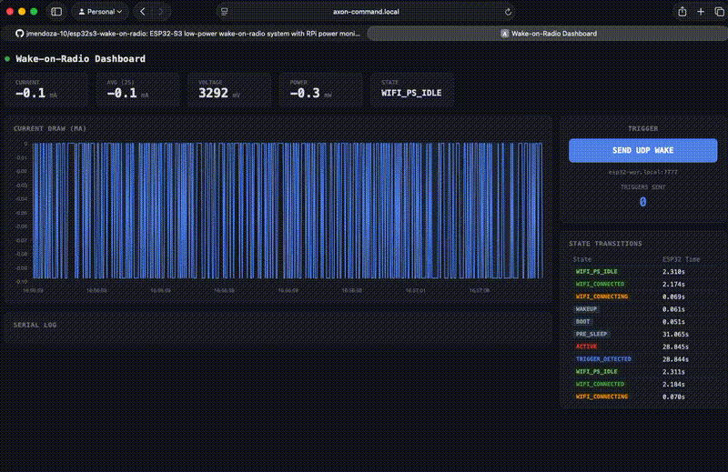
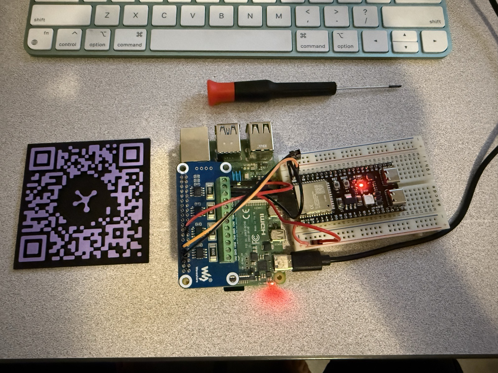
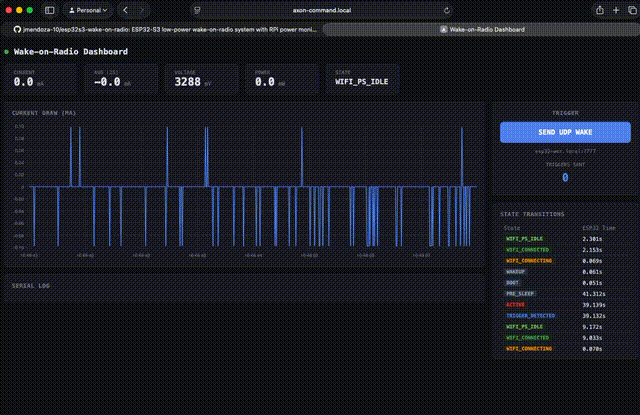

# ESP32-S3 Wake-on-Radio

Low-power wake-on-radio system using ESP-IDF on an ESP32-S3, with a Raspberry Pi as the trigger source, power telemetry dashboard, and Linux kernel driver for interrupt-driven wake detection.



### Phase 1 Hardware Setup



*RPi 4 with Waveshare 4-Channel Current/Power Monitor HAT, ESP32-S3-DevKitC-1 (N16R8) on breadboard. INA219 CH1 measures current through the 3V3 rail, UART TX wired to RPi RX for serial logging.*

## Overview

Compare power consumption across different sleep/wake strategies on the ESP32-S3. The RPi continuously measures current draw via a Waveshare 4-Channel Current/Power Monitor HAT (INA219) and logs state transitions over UART.

A Linux kernel driver (`esp32_wor.ko`) monitors a dedicated GPIO line from the ESP32 as an interrupt source, providing hardware-level wake detection with RTT measurement from UDP trigger to GPIO assertion.

**Targets:** <10 uA deep sleep floor (chip-level), <50 ms wake-to-transmit latency

## Wake Strategies

| Strategy | How it works | Trigger | Expected Power |
|---|---|---|---|
| **baseline** | Deep sleep + timer wakeup | Automatic (10s timer) | ~42 mA active, ~3 mA sleep (dev board) |
| **listen** | Light sleep, periodic Wi-Fi scan for magic SSID | RPi broadcasts soft-AP | ~2-5 mA sleep, ~100 mA scan spikes |
| **espnow** | Light sleep, periodic ESP-NOW listen window | ESP-NOW broadcast (0xA5) | ~2-5 mA sleep, shorter wake windows |
| **ble** | Light sleep, BLE passive scan for trigger name | RPi BLE advertisement | ~10-15 mA scan |
| **dtim** | Stay associated, 802.11 power save mode | UDP packet to port 7777 | **~15 mA avg** (dev board), lowest latency |

## Hardware

- ESP32-S3-DevKitC-1 (N16R8)
- Raspberry Pi 4
- Waveshare 4-Channel Current/Power Monitor HAT
- Cypress CY7C68013A (FX2LP) board (optional, for logic analyzer)

### Wiring

```
                  ┌──────────────────────────────────┐
                  │          Raspberry Pi 4           │
                  │                                   │
                  │  pin 6  (GND)  ◄──────────────────┼──── ESP32 GND
                  │  pin 10 (RX)   ◄──────────────────┼──── ESP32 TX  (GPIO43)
                  │  pin 11 (GPIO17) ◄────────────────┼──── ESP32 Wake (GPIO2)
                  │                                   │
                  │  HAT CH1 IN+   ◄── 3.3V source    │
                  │  HAT CH1 GND  ──► ESP32 GND       │
                  │  HAT CH1 IN-  ──► ESP32 3V3 pin   │
                  └──────────────────────────────────┘
```

| Connection | ESP32 Pin | RPi Pin | Purpose |
|---|---|---|---|
| UART TX | GPIO43 | Pin 10 (RX) | Serial telemetry (`PWR\|<ts>\|<state>`) |
| Wake GPIO | GPIO2 | Pin 11 (GPIO17) | Interrupt-driven wake signal to kernel driver |
| Ground | GND | Pin 6 (GND) | Common ground |
| INA219 | 3V3 rail | HAT CH1 | Current/voltage measurement |

> Do NOT connect USB to the ESP32-S3 during measurement -- the USB-UART bridge draws ~3 mA and masks the true sleep floor.

### Logic Analyzer (FX2LP)

A Cypress CY7C68013A (FX2LP) development board can passively monitor the wake GPIO signal for timing analysis. The board runs the open-source `fx2lafw` firmware (auto-loaded by sigrok) which turns the Port A pins into 8 logic analyzer input channels.

**FX2LP pin mapping (right-side header):**

| Board label | Logic Analyzer Channel | Connect to |
|---|---|---|
| PA0 | CH0 | Wake signal (ESP32 GPIO2 / RPi GPIO17 shared node) |
| PA1 | CH1 | (spare — e.g. UART TX for protocol decode) |
| PA2-PA7 | CH2-CH7 | (spare) |
| GND (left header) | Ground | RPi pin 6 (common GND) |

**Wiring diagram with logic analyzer:**

```
FX2LP Board                      RPi 4 Header              ESP32-S3
(USB to RPi USB-A)               (active signals)           (GPIO output)
──────────────────               ──────────────              ────────────
                                 pin 6  (GND) ◄──────────── GND
PA0 ──────────────────────────── pin 11 (GPIO17) ◄───────── GPIO2 (wake)
GND ──────────────────────────── pin 6  (GND)
                                 pin 10 (RX) ◄────────────── GPIO43 (TX)
```

All three devices (ESP32, RPi, FX2LP) connect to the **same wake signal node** — the FX2LP is purely passive (high-impedance input) and does not affect the signal. All three share a common ground.

**Power:** The FX2LP board is powered via USB from one of the RPi's USB-A ports. Do NOT connect the FX2LP VCC pin to anything — it is a power output, not an input.

**Voltage levels:** All signals are 3.3V. The FX2LP inputs are 3.3V/5V tolerant — no level shifting is needed.

**What to look for in captures:**
- Rising edge on CH0: ESP32 detected a trigger, called `wake_gpio_assert()`
- Falling edge on CH0: ESP32 called `wake_gpio_deassert()` before sleep
- Pulse width: should match the kernel driver's `last_duration_ns` sysfs value
- Glitches < 50ms: the kernel driver filters these (`DEBOUNCE_NS`), but the analyzer captures them for validation

**Software:** The `setup_rpi.sh` script installs `sigrok` and `sigrok-firmware-fx2lafw`. The dashboard auto-detects the FX2LP when plugged in and provides start/stop capture controls with downloadable `.sr` files. Open captures in [PulseView](https://sigrok.org/wiki/PulseView) for detailed analysis.

### Wake GPIO Signal

The ESP32 firmware drives GPIO2 HIGH when a wake trigger is detected and LOW before returning to sleep. The RPi kernel driver catches both edges as interrupts:

```
ESP32 GPIO2 ──wire──► RPi GPIO17
                         │
                   gpiod_to_irq()
                         │
                   ┌─────▼──────┐
                   │  hard IRQ  │  rising edge  = wake start
                   │  handler   │  falling edge = wake end
                   └─────┬──────┘
                         │
              ┌──────────┼──────────────┐
              ▼          ▼              ▼
         wake_count   last_wake_ns   last_duration_ns
              │          │              │
              └───── sysfs ─────────────┘
               /sys/devices/platform/esp32-wor/
```

GPIO stability through deep sleep is maintained by:
- `gpio_hold_en()` — latches GPIO2 LOW through deep sleep and early boot
- Internal pull-down enabled on ESP32 GPIO2
- 500ms debounce in the kernel driver to filter boot glitches

## Prerequisites

- [ESP-IDF](https://docs.espressif.com/projects/esp-idf/en/latest/esp32s3/get-started/) installed and sourced
- ESP32-S3 connected via USB (for flashing only)
- RPi with Waveshare HAT stacked and wired to ESP32-S3

## Quick Start

### 1. Flash the ESP32-S3

```bash
# Source ESP-IDF
. ~/workspace/opensource/esp/esp-idf/export.sh

# Flash baseline (deep sleep + timer)
./scripts/flash_esp32.sh baseline --wifi-ssid YOUR_SSID --wifi-pass YOUR_PASS

# Flash a Phase 2 strategy
./scripts/flash_esp32.sh dtim --wifi-ssid YOUR_SSID --wifi-pass YOUR_PASS
./scripts/flash_esp32.sh listen --wifi-ssid YOUR_SSID --wifi-pass YOUR_PASS
./scripts/flash_esp32.sh ble --wifi-ssid YOUR_SSID --wifi-pass YOUR_PASS
./scripts/flash_esp32.sh espnow --wifi-ssid YOUR_SSID --wifi-pass YOUR_PASS
```

### 2. Deploy to RPi

```bash
# From your Mac — deploys scripts, driver, and installs everything
./scripts/deploy_rpi.sh axon-command.local
```

This will:
- Copy `rpi/` scripts and `driver/` sources to the RPi
- Install system packages (kernel headers, device-tree-compiler, Python deps)
- Build and install the `esp32_wor.ko` kernel module
- Compile and install the Device Tree overlay
- Configure auto-load via `modules-load.d`
- Enable the dashboard systemd service on port 8080

After a reboot, everything starts automatically.

### 3. Verify

```bash
ssh axon@axon-command.local 'cd ~/wake-on-radio && ./verify.sh'
```

### 4. Use the dashboard

Open `http://<rpi-ip>:8080` in a browser. Features:
- Live current draw chart (INA219 at 100 Hz, 2-second rolling average)
- ESP32 state transitions from serial log
- One-click UDP trigger button (auto-detects ESP32 IP)
- Kernel driver status (wake count, GPIO state, pulse duration)
- Wake RTT measurement (UDP send to GPIO interrupt, with avg/p90)
- Burst test mode (automated multi-cycle trigger testing)
- Logic analyzer controls (auto-detects FX2LP, start/stop capture, download `.sr` files)

### 5. Manual trigger

```bash
# DTIM — simplest, just a UDP packet
python3 trigger_dtim.py --host 192.168.0.203 --port 7777

# Listen — broadcast magic SSID
sudo python3 trigger_listen.py --ssid WOR_TRIGGER --duration 30

# BLE — advertise trigger name
sudo python3 trigger_ble.py --name WOR_TRIG --duration 30

# ESP-NOW — via companion ESP32 on USB serial
python3 trigger_espnow.py --mode serial --port /dev/ttyUSB0
```

## Linux Kernel Driver

The `esp32_wor` driver is an out-of-tree platform driver that monitors the ESP32's wake GPIO via interrupt:

| sysfs attribute | Description |
|---|---|
| `wake_count` | Total wake events detected (r/w, reset with `echo 0 >`) |
| `active` | `1` if GPIO is currently HIGH, `0` otherwise |
| `last_wake_ns` | Monotonic timestamp (ns) of last rising edge |
| `last_duration_ns` | Pulse width (ns) of last wake event |

```bash
# Manual usage
sudo insmod ~/wake-on-radio/driver/esp32_wor.ko
cat /sys/devices/platform/esp32-wor/wake_count
cat /sys/devices/platform/esp32-wor/active

# Logs
dmesg | grep esp32_wor
```

The dashboard reads these sysfs files at 10 Hz and computes RTT by comparing the kernel's rising-edge timestamp (`CLOCK_MONOTONIC`) with the Python-side UDP send timestamp (same clock).

## Project Structure

```
esp32s3-wake-on-radio/
├── CMakeLists.txt                  # ESP-IDF project root
├── sdkconfig.defaults              # Base config (ESP32-S3, unicore, UART)
├── sdkconfig.defaults.{listen,espnow,ble,dtim}  # Per-strategy overrides
├── main/
│   ├── CMakeLists.txt              # Conditional compilation per strategy
│   ├── Kconfig.projbuild           # Strategy selection + per-strategy knobs
│   ├── main.c                      # Boot + strategy dispatch
│   ├── deep_sleep.c/h              # Deep sleep with GPIO isolation
│   ├── wifi_connect.c/h            # Wi-Fi init/connect/teardown
│   ├── power_log.c/h               # PWR|/MEAS| protocol over UART
│   ├── wake_gpio.c/h               # Wake GPIO output (held LOW through sleep)
│   ├── strategy_listen.c/h         # Periodic Wi-Fi scan windows
│   ├── strategy_espnow.c/h        # ESP-NOW broadcast listener
│   ├── strategy_ble.c/h            # BLE passive scan (NimBLE)
│   └── strategy_dtim.c/h           # DTIM power save + UDP trigger
├── driver/
│   ├── esp32_wor.c                 # Linux kernel module (platform + GPIO IRQ)
│   ├── Makefile                    # Out-of-tree kernel module build
│   └── esp32-wor-overlay.dts       # Device Tree overlay for RPi 4
├── scripts/
│   ├── flash_esp32.sh              # Build + flash with strategy selection
│   └── deploy_rpi.sh               # SCP + setup on RPi
├── rpi/
│   ├── dashboard.py                # Web dashboard (Flask + SSE + INA219 + driver)
│   ├── templates/dashboard.html    # Dashboard frontend (Chart.js + real-time)
│   ├── esp32-wor-dashboard.service # systemd unit (auto-start on port 8080)
│   ├── serial_logger.py            # UART + INA219 power logger (CSV output)
│   ├── setup_rpi.sh                # I2C/UART/driver/overlay/service setup
│   ├── verify.sh                   # Hardware + driver verification checks
│   ├── trigger_listen.py           # Soft-AP trigger (nmcli)
│   ├── trigger_espnow.py           # ESP-NOW trigger (serial or scapy)
│   ├── trigger_ble.py              # BLE advertisement trigger (hcitool)
│   └── trigger_dtim.py             # UDP packet trigger
└── docs/
    ├── esp32_deepsleep_10sec_timer.gif
    ├── phase1_hardware_setup.jpg
    └── dtim_dashboard.gif          # DTIM strategy dashboard recording
```

## Serial Protocol

The ESP32 emits machine-parseable lines over UART at 115200 baud:

```
PWR|<timestamp_us>|<state>     # State transition (BOOT, WIFI_CONNECTING, etc.)
MEAS|<timestamp_us>|<mV>|<uA> # Power measurement (future: from on-board INA219)
```

The RPi logger interleaves these with INA219 readings into a single CSV:

```csv
rpi_timestamp,type,esp_timestamp_us,state,voltage_mv,current_ua,power_uw
2026-03-27T...,STATE,50518,,BOOT,,,
2026-03-27T...,INA219,,,3260.0,41699.2,135939.5
```

## DTIM Wake Strategy Results



The DTIM strategy keeps the ESP32-S3 associated with the AP using 802.11 power save mode. The radio wakes every 10th DTIM beacon (~1s), draws ~15 mA average on the dev board, and responds to a UDP trigger in under 1 second.

**Key optimizations applied:**
- `listen_interval=10` set before association (AP buffers frames across DTIM periods)
- `WIFI_PS_MAX_MODEM` with auto light sleep (FreeRTOS tickless idle)
- WiFi `MIN_ACTIVE_TIME=10ms`, `WAIT_BROADCAST_DATA_TIME=5ms` (defaults are 50/15ms)

| State | Current | Notes |
|---|---|---|
| Idle (2s avg) | ~15 mA | Dev board with USB bridge overhead |
| Light sleep | 40% of time | Tickless idle + auto PM |
| WiFi duty cycle | <10% | Radio on ~15ms per 1s cycle |
| Trigger latency | <1 s | UDP packet to port 7777 |

## Phase 1 Baseline Results

| State | Current | Notes |
|---|---|---|
| Deep sleep | ~3.1 mA | Dev board floor (USB bridge + LED contribute ~2-3 mA) |
| Boot + app init | 42-54 mA | |
| Wi-Fi init | 47-50 mA | |
| PHY calibration | 102-110 mA | |
| Wi-Fi TX burst | 247-320 mA | Voltage sag to ~3.06V confirms high draw |
| Wi-Fi steady state | 97-115 mA | |
| Wake-to-connected | ~2,050 ms | After first boot (no auth retries) |
