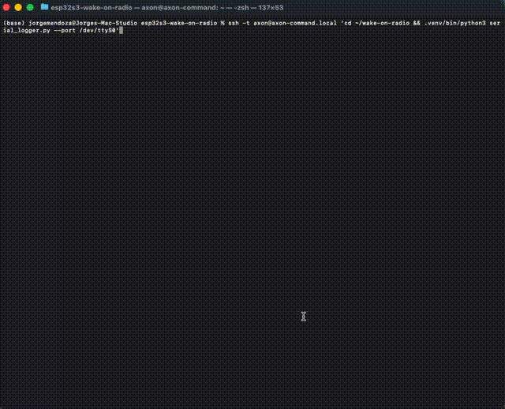

# ESP32-S3 Wake-on-Radio

Low-power wake-on-radio system using ESP-IDF on an ESP32-S3, with a Raspberry Pi as the trigger source and power telemetry dashboard.



### Phase 1 Hardware Setup


*RPi 4 with Waveshare 4-Channel Current/Power Monitor HAT, ESP32-S3-DevKitC-1 (N16R8) on breadboard. INA219 CH1 measures current through the 3V3 rail, UART TX wired to RPi RX for serial logging.*

## Overview

Compare power consumption across different sleep/wake strategies on the ESP32-S3. The RPi continuously measures current draw via a Waveshare 4-Channel Current/Power Monitor HAT (INA219) and logs state transitions over UART.

**Targets:** <10 uA deep sleep floor (chip-level), <50 ms wake-to-transmit latency

## Wake Strategies

| Strategy | How it works | Trigger | Expected Power |
|---|---|---|---|
| **baseline** | Deep sleep + timer wakeup | Automatic (10s timer) | ~42 mA active, ~3 mA sleep (dev board) |
| **listen** | Light sleep, periodic Wi-Fi scan for magic SSID | RPi broadcasts soft-AP | ~2-5 mA sleep, ~100 mA scan spikes |
| **espnow** | Light sleep, periodic ESP-NOW listen window | ESP-NOW broadcast (0xA5) | ~2-5 mA sleep, shorter wake windows |
| **ble** | Light sleep, BLE passive scan for trigger name | RPi BLE advertisement | ~10-15 mA scan |
| **dtim** | Stay associated, 802.11 power save mode | UDP packet to port 7777 | ~5-20 mA avg, lowest latency |

## Hardware

- ESP32-S3-DevKitC-1 (N16R8)
- Raspberry Pi 4
- Waveshare 4-Channel Current/Power Monitor HAT

### Wiring

```
3.3V source ---------> HAT CH1 IN+
                        HAT CH1 GND ----> ESP32-S3 GND
                        HAT CH1 IN- ----> ESP32-S3 3V3 pin
RPi GND (pin 6) -----> ESP32-S3 GND
ESP32-S3 TX (GPIO 43) > RPi RX (pin 10)
```

> Do NOT connect USB to the ESP32-S3 during measurement -- the USB-UART bridge draws ~3 mA and masks the true sleep floor.

## Prerequisites

- [ESP-IDF](https://docs.espressif.com/projects/esp-idf/en/latest/esp32s3/get-started/) installed and sourced
- ESP32-S3 connected via USB (for flashing only)
- RPi with Waveshare HAT stacked and wired to ESP32-S3

## Quick Start

### 1. Flash the ESP32-S3

```bash
# Source ESP-IDF
. ~/workspace/opensource/esp/esp-idf/export.sh

# Flash baseline (deep sleep + timer)
./scripts/flash_esp32.sh baseline --wifi-ssid YOUR_SSID --wifi-pass YOUR_PASS

# Flash a Phase 2 strategy
./scripts/flash_esp32.sh dtim --wifi-ssid YOUR_SSID --wifi-pass YOUR_PASS
./scripts/flash_esp32.sh listen --wifi-ssid YOUR_SSID --wifi-pass YOUR_PASS
./scripts/flash_esp32.sh ble --wifi-ssid YOUR_SSID --wifi-pass YOUR_PASS
./scripts/flash_esp32.sh espnow --wifi-ssid YOUR_SSID --wifi-pass YOUR_PASS
```

### 2. Set up the RPi

```bash
# From your Mac — deploys scripts and installs dependencies
./scripts/deploy_rpi.sh axon-command.local

# Or manually
scp -r rpi/ axon@axon-command.local:~/wake-on-radio/
ssh axon@axon-command.local 'bash ~/wake-on-radio/setup_rpi.sh'
```

### 3. Start power logging

```bash
ssh -t axon@axon-command.local \
  'cd ~/wake-on-radio && .venv/bin/python3 serial_logger.py --port /dev/ttyS0'
```

### 4. Send a trigger (Phase 2)

```bash
# DTIM — simplest, just a UDP packet
python3 trigger_dtim.py --host 192.168.0.203 --port 7777

# Listen — broadcast magic SSID
sudo python3 trigger_listen.py --ssid WOR_TRIGGER --duration 30

# BLE — advertise trigger name
sudo python3 trigger_ble.py --name WOR_TRIG --duration 30

# ESP-NOW — via companion ESP32 on USB serial
python3 trigger_espnow.py --mode serial --port /dev/ttyUSB0
```

## Project Structure

```
esp32s3-wake-on-radio/
├── CMakeLists.txt                  # ESP-IDF project root
├── sdkconfig.defaults              # Base config (ESP32-S3, unicore, UART)
├── sdkconfig.defaults.{listen,espnow,ble,dtim}  # Per-strategy overrides
├── main/
│   ├── CMakeLists.txt              # Conditional compilation per strategy
│   ├── Kconfig.projbuild           # Strategy selection + per-strategy knobs
│   ├── main.c                      # Boot + strategy dispatch
│   ├── deep_sleep.c/h              # Deep sleep with GPIO isolation
│   ├── wifi_connect.c/h            # Wi-Fi init/connect/teardown
│   ├── power_log.c/h               # PWR|/MEAS| protocol over UART
│   ├── strategy_listen.c/h         # Periodic Wi-Fi scan windows
│   ├── strategy_espnow.c/h         # ESP-NOW broadcast listener
│   ├── strategy_ble.c/h            # BLE passive scan (NimBLE)
│   └── strategy_dtim.c/h           # DTIM power save + UDP trigger
├── scripts/
│   ├── flash_esp32.sh              # Build + flash with strategy selection
│   └── deploy_rpi.sh               # SCP + setup on RPi
├── rpi/
│   ├── serial_logger.py            # UART + INA219 power logger (CSV output)
│   ├── setup_rpi.sh                # I2C/UART setup, Python venv
│   ├── verify.sh                   # Hardware verification checks
│   ├── trigger_listen.py           # Soft-AP trigger (nmcli)
│   ├── trigger_espnow.py           # ESP-NOW trigger (serial or scapy)
│   ├── trigger_ble.py              # BLE advertisement trigger (hcitool)
│   └── trigger_dtim.py             # UDP packet trigger
└── docs/
    └── esp32_deepsleep_10sec_timer.gif
```

## Serial Protocol

The ESP32 emits machine-parseable lines over UART at 115200 baud:

```
PWR|<timestamp_us>|<state>     # State transition (BOOT, WIFI_CONNECTING, etc.)
MEAS|<timestamp_us>|<mV>|<uA> # Power measurement (future: from on-board INA219)
```

The RPi logger interleaves these with INA219 readings into a single CSV:

```csv
rpi_timestamp,type,esp_timestamp_us,state,voltage_mv,current_ua,power_uw
2026-03-27T...,STATE,50518,,BOOT,,,
2026-03-27T...,INA219,,,3260.0,41699.2,135939.5
```

## Phase 1 Baseline Results

| State | Current | Notes |
|---|---|---|
| Deep sleep | ~3.1 mA | Dev board floor (USB bridge + LED contribute ~2-3 mA) |
| Boot + app init | 42-54 mA | |
| Wi-Fi init | 47-50 mA | |
| PHY calibration | 102-110 mA | |
| Wi-Fi TX burst | 247-320 mA | Voltage sag to ~3.06V confirms high draw |
| Wi-Fi steady state | 97-115 mA | |
| Wake-to-connected | ~2,050 ms | After first boot (no auth retries) |
